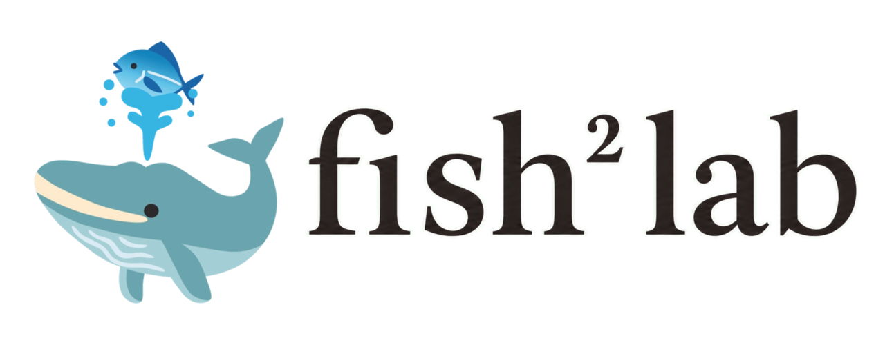

  
  

    
    
    
    
    
    
  

## Silas Su · 苏心贤

PhD student at Beijing Jiaotong University, working on **LLM security and agent harnesses**: how an agent system tells the model *who said what*, and what breaks when it cannot. I also shoot medium-format film, study mathematics, and write about the systems that shape learning and everyday life.

北京交通大学博士生，做 **LLM 安全与 agent harness**：系统怎样告诉模型「这段话是谁说的」，这件事失灵时会发生什么。也拍中画幅胶片、学数学，记录技术、学习与日常生活里的系统性问题。

## Now · 2026‑09

<table>
  <tr>
    <td width="130" valign="top"><strong>🔬 Researching</strong></td>
    <td>Provenance inside the context window. A model decides whom to trust with two systems: role tokens it cannot forge but that only split <em>mine</em> from <em>theirs</em>, and text shapes it learned from harnesses in post‑training, fine‑grained but forgeable by anyone. Prompt injection lives in the gap between them. Probing this on open weights of <a href="https://api-docs.deepseek.com/">DeepSeek V4.1 Flash</a>: does a role header change what the model reads, and is a successful injection always one that got selected?</td>
  </tr>
  <tr>
    <td valign="top"><strong>✍️ Writing</strong></td>
    <td>A position paper arguing the agent harness does not disappear under scaling, it shrinks to a kernel: four operations on context structure (<code>execute</code>, <code>cut</code>, <code>fork</code>, <code>partition</code>) and not one line of prompt. Everything a harness does by <em>saying</em> gets absorbed into the weights; what it does by <em>placing</em> cannot be.</td>
  </tr>
  <tr>
    <td valign="top"><strong>🚢 Shipping</strong></td>
    <td><a href="https://github.com/fish2lab/DSCodex">DSCodex</a> v1.2.1, a local router that puts DeepSeek V4.1 Flash into the stock Codex / ChatGPT desktop app. A macOS Dock‑reopen fix merged upstream into <a href="https://github.com/l0ng-ai/tty7/pull/880">tty7</a>.</td>
  </tr>
  <tr>
    <td valign="top"><strong>📷 Elsewhere</strong></td>
    <td>Film scans going up at <a href="https://portfolio.fish2lab.com">portfolio.fish2lab.com</a>; a Touhou fan‑game side project about a perishable flow and four storable stocks.</td>
  </tr>
</table>

## Building

<table>
  <tr>
    <td width="50%" valign="top">
      <strong><a href="https://github.com/fish2lab/DSCodex">DSCodex</a></strong>
      &nbsp;
       
      DeepSeek V4.1 Flash inside the unmodified ChatGPT desktop app, Codex CLI and IDE. Local loopback router, native Responses API, full tool loops, GPT OAuth kept side by side. No fork, no patch. 
      在原版 Codex / ChatGPT 桌面端同时使用 DeepSeek 与 GPT。<code>JavaScript · MIT</code>
    </td>
    <td width="50%" valign="top">
      <strong><a href="https://github.com/l0ng-ai/tty7">tty7</a></strong>
      &nbsp; 
      A pure‑Rust terminal workbench on Zed's gpui with persistent sessions and coding‑agent awareness. My contribution answers the macOS Dock's reopen event, so a tty7 whose last window was closed comes back instead of staying retired. 
      给 tty7 补上 macOS Dock 重新打开窗口的行为。<code>Rust</code>
    </td>
  </tr>
  <tr>
    <td valign="top">
      <strong><a href="https://github.com/fish2lab/bjtu-cli">bjtu-cli</a></strong> · <strong><a href="https://github.com/fish2lab/BJTUselfService-macOS">BJTUselfService‑macOS</a></strong> 
      The campus MIS, AA and course platforms as a command‑line client built for coding agents to drive, and as a native SwiftUI app with Liquid Glass and course grabbing. 
      北交大校园系统的 CLI 与 macOS 原生版。<code>Swift</code>
    </td>
    <td valign="top">
      <strong><a href="https://github.com/fish2lab/sukima-ml">sukima-ml</a></strong> 
      Website for 隙间月影 Sukima Moonlight, a doujin circle pairing classic paintings with Touhou Project. Dual‑frame gallery, a Galgame‑style guide, museum‑grade CSS matting. 
      名画与东方 Project 的邂逅。<code>TypeScript · Docusaurus</code>
    </td>
  </tr>
</table>

**Upstream** · [typex-ink/Typex #2](https://github.com/typex-ink/Typex/pull/2) adds Xiaomi MiMo ASR and explicit hotkey trigger modes.

## Where things live · 内容入口

<table>
  <tr>
    <td width="33%" valign="top">
      <strong>Portfolio · 作品集</strong> 
      Medium‑format documentary, landscape, street and conceptual series. 
      <a href="https://portfolio.fish2lab.com">portfolio.fish2lab.com →</a>
    </td>
    <td width="33%" valign="top">
      <strong>Research · 研究</strong> 
      Field notes, probes and work in progress on LLM security and agent systems. 
      <a href="https://research.fish2lab.com">research.fish2lab.com →</a>
    </td>
    <td width="33%" valign="top">
      <strong>Blog · 文章</strong> 
      Essays on cognitive science, learning, health and everyday systems. 
      <a href="https://blog.fish2lab.com">blog.fish2lab.com →</a>
    </td>
  </tr>
</table>

## Activity

  <a href="https://github.com/fish2lab">
    <picture>
      <source media="(prefers-color-scheme: dark)" srcset="https://ghchart.rshah.org/26a641/fish2lab" />
      
    </picture>
  </a>

  <a href="https://github.com/fish2lab">
    <picture>
      <source media="(prefers-color-scheme: dark)" srcset="https://github-readme-activity-graph.vercel.app/graph?username=fish2lab&bg_color=0d1117&color=8b949e&line=26a641&point=3fb950&area_color=0e4429&area=true&hide_border=true&hide_title=true&radius=0&height=300&days=31&grid=false" />
      
    </picture>
  </a>

闲来垂钓碧溪上，忽复乘舟梦日边

